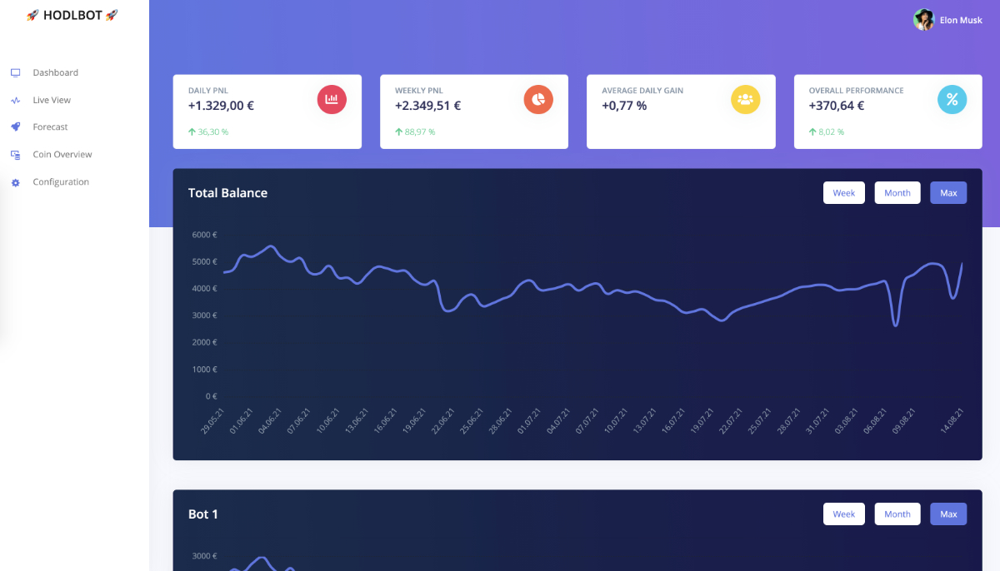

## 🚀 HODLBOT 🚀

This is a profit monitor for [this binance bot](https://github.com/edeng23/binance-trade-bot).

Status: Alpha (use at your own risk, data can be inaccurate)

**Everybody is welcomed to enhance this monitor.
Share and discuss your ideas in the [issue section](https://github.com/sydekumf/hodlbot/issues).**



### Setup
You should run this on a web server with PHP 7.4 and MySQL 8.0.

The default configuration is for two separate bots. Adjust the configuration
to your own needs, add more bots or remove them.

- Deploy everything to your web server
- Copy config/bot.php.tpl to config/bot.php and change the values in there
- Copy `.env.example` to `.env` and change the following:
    - Database credentials and information
    - Database paths for your bot(s): Absolute path to the sqlite file
    - `BINANCE_PUBLIC_KEY` and `BINANCE_PRIVATE_KEY`
    - `APP_URL`
- Configure a cron job to run the following command every minute: `php artisan schedule:run`
- Run the following commands:
    ```bash
    composer install
    composer dump-autoload
    php artisan key:generate
    php artisan migrate --seed
    ```

The SQLite databases of the binance trade bot (configured in `.env`) should be readable by
the web server.

In order to update the balances on a daily basis you need to setup a cron job like this:
```bash
* * * * * www-data cd /var/www/html/hodlbot && php artisan schedule:run >> /dev/null 2>&1
```

### Configuration and Start
Open `config/bot.php` and configure everything you want. You can define as many bots
as you want or reduce them. The following should be edited by you:
- name
- id
- start_balance
- coin_list
- bridge
- start_date

Open `config/database.php` and edit `bot1` and `bot2` to your needs (depending on the
number of bots you have). Copy the definition if you have more bots. Keep in mind the key
`bot1` is the id you defined in `config/bot.php`.

The absolute paths to the SQLite database is configured in `.env`.

You can just register your own user which has immediate access to the monitor.
There is also a default user registered. Therefore you should also restrict the access 
to the hosted site via HTTP Auth, as anybody can currently register and access the data.
